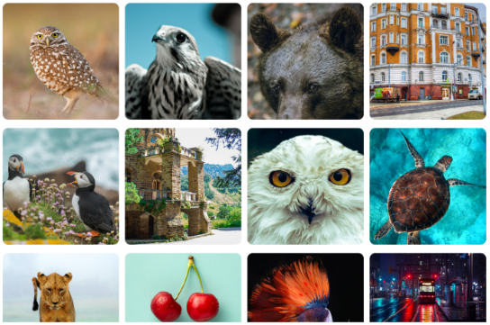

# React Image Gallery

## Tasks:
-> In this mini project, we are required to create an image gallery using React. 
-> The gallery should fetch a set of images from <a href='https://drive.google.com/file/d/1O7j0icYwTGiqZLUWm8iff6bCb72aiqW2/view'>Api</a>, limit the result to 20 images, and display them in a user-friendly UI. 
-> Upon clicking on any image, the user should be redirected to a single image view, where additional information, such as the tile and description of the image, is shown.

## Requirements:
-> Create a new React application using create-react-app or any preferred React boilerplate. 
-> Implement a gallery component that displays the first 20 images fetched form the server. Each image should be displayed with a thumbnail and relevant details. 
-> Add functionality to handle user interaction. Clicking on any thumnail in the gallery should redirect the user to a new page showing the single image in a larger view. 
-> On the single image page, display the enlarged image along with its title and description. 
-> Use React router Dom to handle navigation between the gallery and single image view. 
-> Ensure error handling for cases where the server request fails or returns no images.

# Home Page

# Details Page

## Check it out live here: <a href='https://dev.imagegallery.netlify.app' >Click On Me 😎</a>